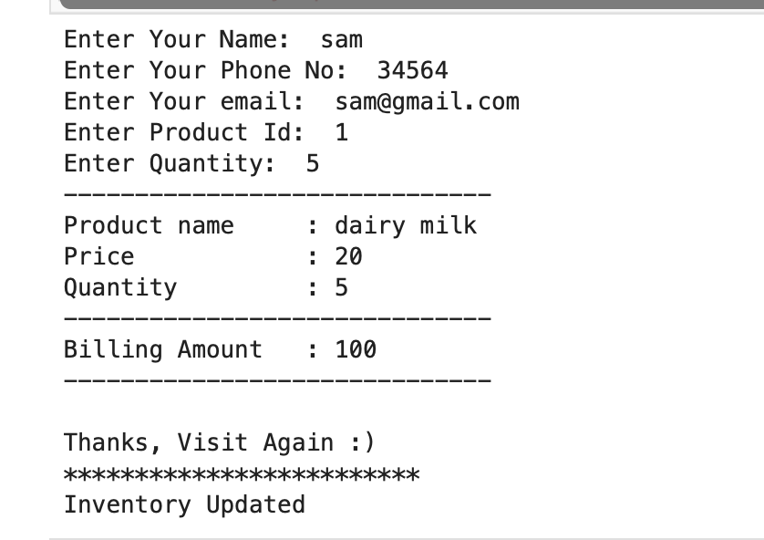
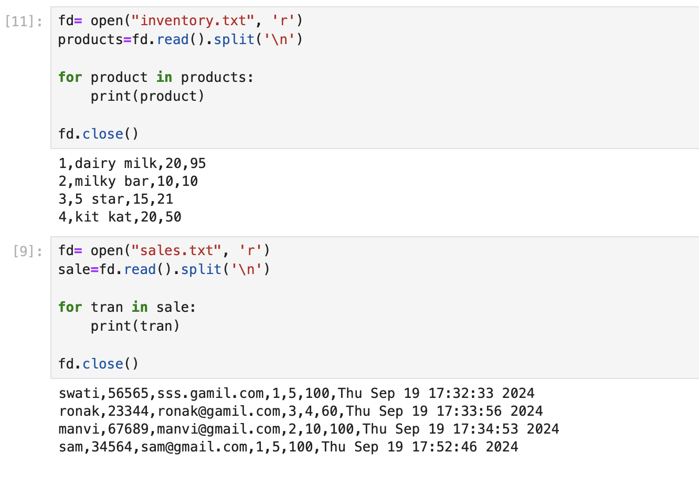

# Hii, I'm Swati Bhatt👩🏻‍💻!

# Inventory Management Using Files🗂️  

This is a simple inventory management system implemented in Python using Jupyter Notebook for handling basic inventory operations like adding items, updating stock, and recording sales. 

The system utilizes two text files: sales.txt and inventory.txt to manage data.

##  ☞Tech Stack Used 🖇️

##  ☞Features🧐
- Inventory Management: Track product stock levels.
- Sales Tracking: Record and manage sales transactions.
- File-Based Data Storage: Utilizes text files (inventory.txt and sales.txt) for storing inventory and sales data.
- Console Interface: A basic user interface for interacting with the system using the Jupyter Notebook.

## Files Used

### inventory.txt:
Stores the product information such as item-id, item name, quantity, and price.
### sales.txt: 
Keeps track of sales transactions including the user_name, user_phone, user_email, item_purchased_id, quantity_purchased, total sale amount, time of transection.

##  ☞Sneak Peak 🫣

##  ☞Feedback✍🏻
I’d love to hear your thoughts on this project and would really appreciate any suggestions you have. Please feel free to reach out to me at:
get.swatibhatt@gmail.com

##  ☞Contact Me 📩
 

